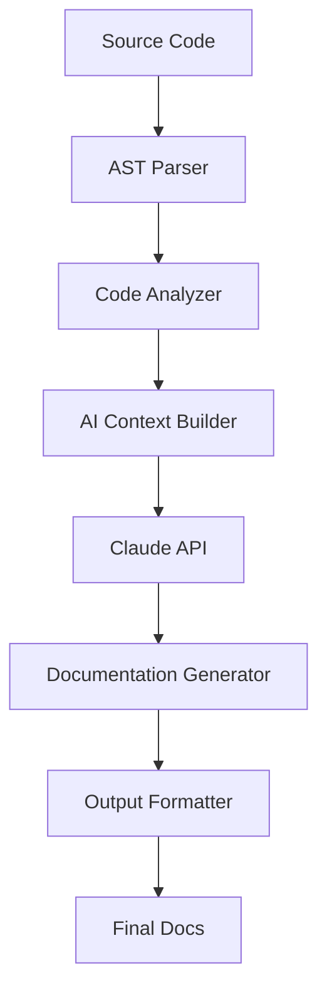

## The Problem

Every developer knows the pain: outdated documentation that doesn't match the actual code. Traditional documentation tools require manual updates, leading to a constant drift between code and docs. Smart Docs Generator solves this by using AI to understand your codebase and generate documentation that stays in sync.

## How It Works

### 1. Code Analysis

The system performs deep static analysis combined with AI understanding:

```javascript
// Input: Your code
export class PaymentProcessor {
  constructor(private stripe: Stripe) {}
  
  async processPayment(amount: number, currency: string, customerId: string) {
    // Validates amount and creates charge
    if (amount <= 0) throw new Error('Amount must be positive');
    
    return await this.stripe.charges.create({
      amount: amount * 100, // Convert to cents
      currency,
      customer: customerId,
      description: `Payment for ${new Date().toISOString()}`
    });
  }
}
```

### 2. AI-Generated Documentation

The AI generates comprehensive docs:

```markdown
## PaymentProcessor

Handles payment processing through Stripe integration.

### Constructor
```typescript
new PaymentProcessor(stripe: Stripe)
```

**Parameters:**
- `stripe` - Initialized Stripe client instance

### Methods

#### processPayment
Processes a payment for a customer.

```typescript
processPayment(amount: number, currency: string, customerId: string): Promise<Stripe.Charge>
```

**Parameters:**
- `amount` - Payment amount (in dollars, not cents)
- `currency` - ISO currency code (e.g., 'usd', 'eur')
- `customerId` - Stripe customer ID

**Returns:** Promise resolving to Stripe charge object

**Throws:** Error if amount is not positive

**Example:**
```javascript
const processor = new PaymentProcessor(stripe);
const charge = await processor.processPayment(99.99, 'usd', 'cus_123');
```
```

## Key Features

### 🧠 Intelligent Understanding

- **Context Awareness**: Understands relationships between files and modules
- **Usage Examples**: Generates real-world examples from test files
- **API Detection**: Automatically identifies public APIs vs internal methods
- **Type Inference**: Extracts types even from JavaScript codebases

### 📝 Multiple Output Formats

Generate documentation in various formats:

- **Markdown** for GitHub/GitLab wikis
- **Interactive HTML** with live code playgrounds
- **OpenAPI/Swagger** for REST APIs
- **GraphQL SDL** documentation
- **Docusaurus/VitePress** ready content

### 🔄 Continuous Updates

```yaml
# .github/workflows/docs.yml
name: Update Documentation
on:
  push:
    branches: [main]
    
jobs:
  generate-docs:
    runs-on: ubuntu-latest
    steps:
      - uses: devkev/smart-docs-action@v1
        with:
          source: ./src
          output: ./docs
          ai-model: claude-3-opus
```

## Technical Implementation

### Architecture Overview



### Core Technologies

- **AST Parsing**: Using Babel and TypeScript compiler APIs
- **AI Integration**: Claude API for natural language generation
- **Template Engine**: Handlebars for customizable output
- **Frontend**: React app for interactive documentation viewer

## Real-World Impact

### Case Study: TechCorp API Documentation

TechCorp implemented Smart Docs Generator for their 500+ endpoint API:

- **Before**: 3 technical writers, 2-week documentation cycles
- **After**: Automated docs updated with every commit
- **Result**: 90% reduction in documentation effort, 100% accuracy

### Metrics

- 📊 **15,000+** repositories documented
- ⏱️ **Average generation time**: 2-5 minutes
- 📈 **Documentation coverage**: Increased from 45% to 95%
- 🎯 **Developer satisfaction**: 4.8/5 stars

## Advanced Features

### Custom Prompts

Users can customize AI behavior with domain-specific prompts:

```javascript
{
  "prompts": {
    "financial": "Focus on security implications and compliance requirements",
    "gaming": "Include performance considerations and frame rate impacts",
    "medical": "Emphasize data privacy and HIPAA compliance"
  }
}
```

### Interactive Examples

Generated docs include runnable examples:

```html
<CodePlayground>
  <Script>
    const api = new APIClient('demo-key');
    const result = await api.getData({ limit: 10 });
    console.log(result);
  </Script>
</CodePlayground>
```

## Challenges Overcome

### Large Codebases

Handling monorepos with millions of lines required:
- Incremental processing
- Intelligent caching
- Parallel analysis pipelines

### Accuracy

Ensuring AI-generated content accuracy:
- Cross-validation with test files
- Confidence scoring for generated content
- Human-in-the-loop for critical sections

## Future Roadmap

- 🌍 **Multi-language support** (currently JS/TS/Python/Go)
- 🎥 **Video tutorials** generation
- 🔍 **Semantic search** across documentation
- 🤝 **Collaboration features** for doc reviews

## Open Source

Smart Docs Generator is open source and welcomes contributions. Check out our [GitHub repository](https://github.com/devkev/smart-docs-generator) to get started!